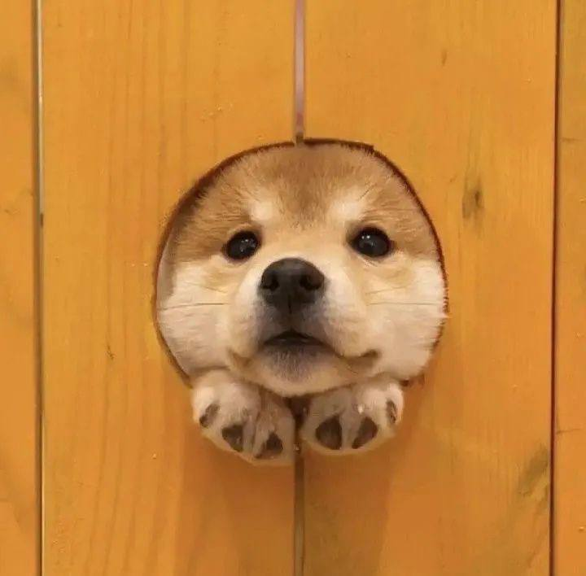

# Обо мне

Привет! Я — человек, который знает толк в уюте и свободе.
Люблю собак, дождь и вечерние прогулки, когда город уже зевает, а я только начинаю оживать. Мой идеальный маршрут — от заката и до самой полуночи, когда фонари становятся моими единственными спутниками.

Фотография — моя страсть, но иногда вдохновение уходит в отпуск, особенно когда мозг перегружен. Тогда я переключаюсь на рисование: не шедевры, конечно, но зато искренне и в стиле "я так вижу!" — стараюсь, как могу.

В душе я программист: могла бы сутками сидеть дома, работать удалённо и быть абсолютно счастлива. Офисные будни и работа с людьми — не моё, потому что "душные зануды" и "истерички" — это явно не та компания, в которой я хочу проводить лучшие годы жизни.

В общем, я — человек-уют, человек-ночь, человек-креатив. Ищу вдохновение в простых радостях и всегда рада новым открытиям (желательно без лишних людей поблизости).

